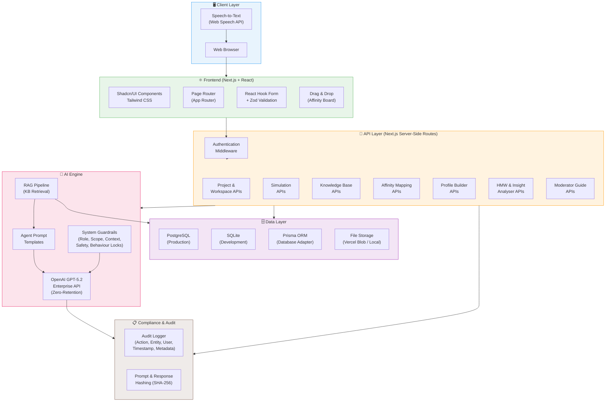
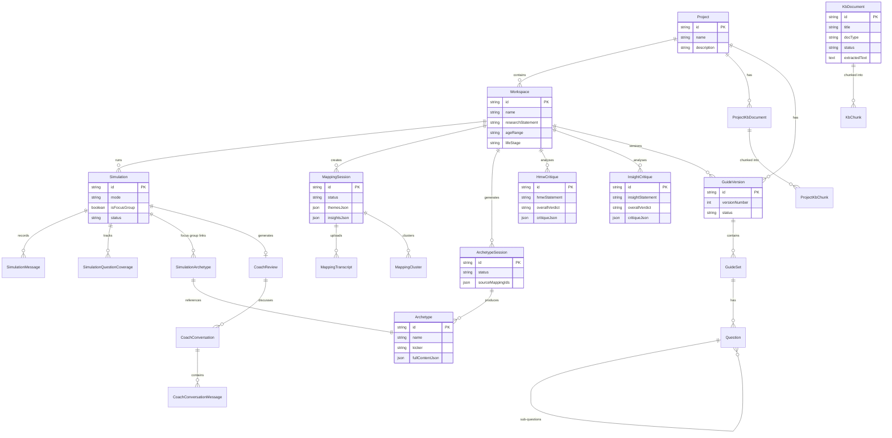
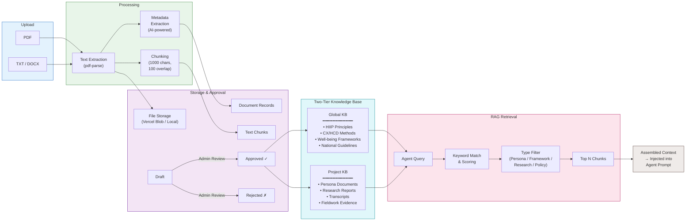
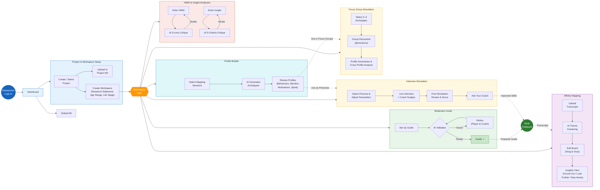
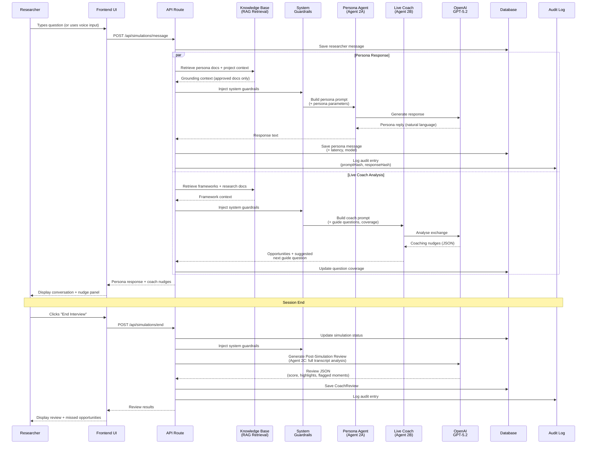
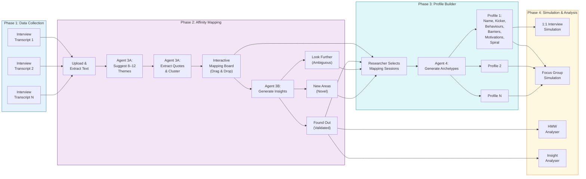
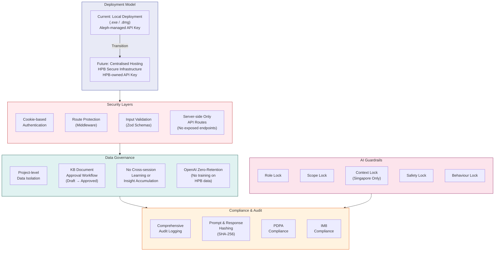
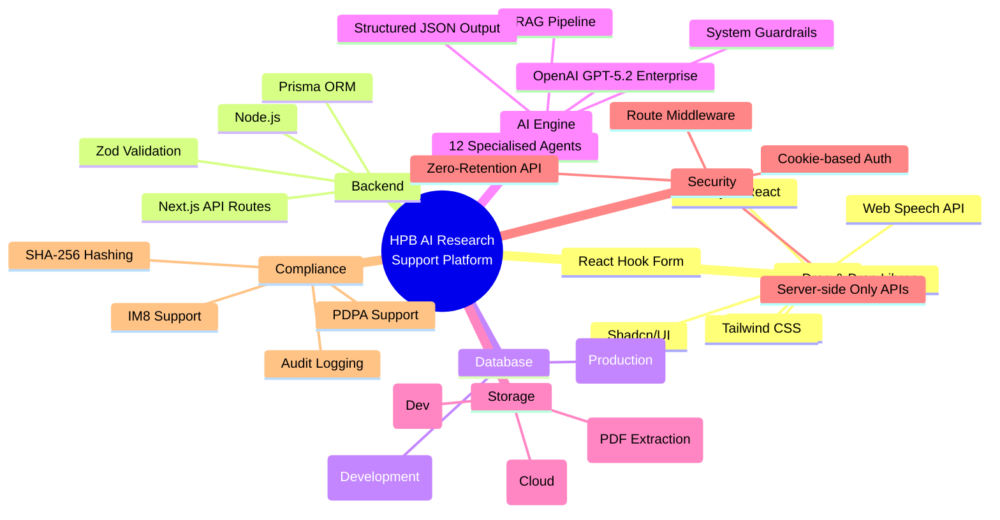

# HPB AI Research Support Platform — Architecture Diagrams

> All diagrams use [Mermaid](https://mermaid.js.org/) syntax. Render in any Mermaid-compatible viewer (GitHub, VS Code with Mermaid extension, mermaid.live, etc.)

---

## 1. High-Level System Architecture

---

## 2. Data Model & Entity Relationships

---

## 3. AI Agent Architecture & Data Flow

```mermaid
flowchart LR
    subgraph INPUT["Input & Validation"]
        direction TB
        USER_Q["Researcher's<br/>Question / Action"]
        VALIDATE["Zod Schema<br/>Validation"]
        CONTEXT["Context Assembly<br/>(KB Docs, Frameworks)"]
        USER_Q --> VALIDATE --> CONTEXT
    end

    subgraph GUARDRAILS_BLOCK["Guardrails"]
        direction TB
        G1["Role Lock"]
        G2["Scope Lock"]
        G3["Context Lock"]
        G4["Safety Lock"]
        G5["Behaviour Lock"]
        G6["Content Lock"]
        G7["Grounding Lock"]
    end

    subgraph AGENTS["12 AI Agents (by Use Case)"]
        direction TB

        subgraph ROW1[" "]
            direction LR
            subgraph UC1["UC 1: Moderator Guide"]
                A1A["1A Question<br/>Validation"]
                A1B["1B Research<br/>Consistency"]
            end
            subgraph UC2["UC 2: Interview Simulation"]
                A2A["2A Persona<br/>Simulation"]
                A2B["2B Live Coach"]
                A2C["2C Post-Sim<br/>Review"]
                A2D["2C+ Coach Chat"]
            end
        end

        subgraph ROW2[" "]
            direction LR
            subgraph UC3["UC 3: Affinity Mapping"]
                A3A["3A Theme &<br/>Clustering"]
                A3B["3B Insights<br/>(3-Column)"]
            end
            subgraph UC4["UC 4: Profile Builder"]
                A4["4 Archetype<br/>Generation"]
                A4F["4+ Focus Group"]
            end
            subgraph UC5_6["UC 5–6: Analysers"]
                A5["5 HMW<br/>(NN/g 5-Lens)"]
                A6["6 Insight<br/>(5 Criteria)"]
            end
        end
    end

    subgraph LLM["LLM"]
        OPENAI_API["OpenAI GPT-5.2<br/>Enterprise<br/>(Zero-Retention)"]
    end

    subgraph OUTPUT["Output"]
        direction TB
        PARSE["Response Parsing<br/>(JSON / Natural Lang)"]
        PERSIST["DB Persistence"]
        AUDIT_LOG["Audit Log<br/>(hashes, latency)"]
        PARSE --> PERSIST
        PARSE --> AUDIT_LOG
    end

    CONTEXT --> GUARDRAILS_BLOCK
    GUARDRAILS_BLOCK --> AGENTS
    AGENTS --> OPENAI_API
    OPENAI_API --> PARSE

    style INPUT fill:#e3f2fd,stroke:#1976D2
    style GUARDRAILS_BLOCK fill:#ffebee,stroke:#c62828
    style AGENTS fill:#f5f5f5,stroke:#9E9E9E
    style ROW1 fill:transparent,stroke:transparent
    style ROW2 fill:transparent,stroke:transparent
    style UC1 fill:#e8f5e9,stroke:#388E3C
    style UC2 fill:#fff8e1,stroke:#F9A825
    style UC3 fill:#f3e5f5,stroke:#7B1FA2
    style UC4 fill:#e0f2f1,stroke:#00897B
    style UC5_6 fill:#fbe9e7,stroke:#D84315
    style LLM fill:#fce4ec,stroke:#C2185B
    style OUTPUT fill:#efebe9,stroke:#5D4037
```

---

## 4. Knowledge Base & RAG Pipeline

---

## 5. User Workflow & Feature Flow

---

## 6. Interview Simulation Data Flow (Detailed)

---

## 7. Affinity Mapping & Profile Builder Pipeline

---

## 8. Security, Governance & Deployment Architecture

---

## 9. Technology Stack Overview

---

*Diagrams prepared by Aleph Labs for HPB AI Research Support Platform documentation.*
